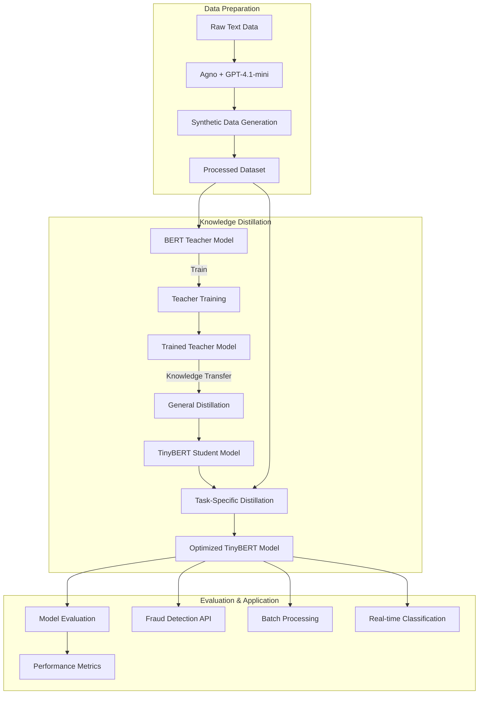

# Financial Fraud Detection using TinyBERT

This project implements a TinyBERT-based model for detecting financial fraud in text data. It uses knowledge distillation from a BERT model to create a smaller, faster model that can efficiently identify financial fraud-related content.

## Project Structure

```
financial_fraud_detection/
├── data/                  # Data storage and processing scripts
├── models/                # Model implementation files
├── utils/                 # Utility functions
├── scripts/               # Training and evaluation scripts
├── output/                # Output directory for trained models and evaluation results
├── run.py                 # Main script to run the entire pipeline
├── requirements.txt       # Project dependencies
├── .env                   # Environment variables (API keys)
└── README.md              # Project documentation
```

## Setup

1. Clone the repository and navigate to the project directory:
   ```bash
   git clone <repository-url>
   cd financial_fraud_detection
   ```

2. Install the required dependencies:
   ```bash
   pip install -r requirements.txt
   ```

3. Set up your OpenAI API key in the `.env` file:
   ```
   OPENAI_API_KEY=your_openai_api_key_here
   ```

## Running the Application

The application can be run using the `run.py` script, which provides a unified interface for all operations. You can run specific steps or the entire pipeline.

### 1. Data Preparation

Prepare the financial fraud dataset with realistic examples using Agno and GPT-4.1-mini:

```bash
python run.py --action prepare --data_dir ./data --use_agno --use_openai
```

Options:
- `--fraud_samples`: Number of fraud samples to generate (default: 1000)
- `--non_fraud_samples`: Number of non-fraud samples to generate (default: 10000)
- `--use_agno`: Use Agno for data generation
- `--use_openai`: Use OpenAI GPT-4.1-mini for data generation

If neither `--use_agno` nor `--use_openai` is specified, the script will fall back to synthetic data generation.

### 2. Model Training

Train the BERT teacher model and TinyBERT student model using knowledge distillation:

```bash
python run.py --action train --data_dir ./data --output_dir ./output
```

Options:
- `--teacher_epochs`: Number of epochs for teacher model training (default: 3)
- `--general_distill_epochs`: Number of epochs for general distillation (default: 5)
- `--task_distill_epochs`: Number of epochs for task-specific distillation (default: 5)
- `--batch_size`: Batch size for training (default: 16)
- `--seed`: Random seed for reproducibility (default: 42)

### 3. Model Evaluation

Evaluate the trained models and compare their performance:

```bash
python run.py --action evaluate --data_dir ./data --output_dir ./output
```

This will generate evaluation metrics and comparison charts in the `output/evaluation` directory.

### 4. Run the Entire Pipeline

To run the entire pipeline (data preparation, training, and evaluation) in one command:

```bash
python run.py --action all --data_dir ./data --output_dir ./output --use_agno --use_openai
```

## Implementation Details

This implementation follows the TinyBERT approach described in the paper "TinyBERT: Distilling BERT for Natural Language Understanding" (Jiao et al., 2020). The training process consists of two stages:

1. **General Distillation**: TinyBERT learns from a pre-trained BERT model to gain general language knowledge.
2. **Task-Specific Distillation**: TinyBERT is further trained with a fine-tuned BERT model on the financial fraud detection task.

The model uses transformer distillation to transfer knowledge from BERT to TinyBERT at three levels:
- Embedding layer distillation
- Transformer layer distillation (attention and hidden states)
- Prediction layer distillation

## Data Generation

The project uses three approaches for generating financial fraud data:

1. **Agno with GPT-4.1-mini**: Uses Agno agents with GPT-4.1-mini to generate high-quality, domain-specific financial fraud and legitimate financial texts.

2. **Direct OpenAI API**: Falls back to direct OpenAI API calls if Agno is not available, still using GPT-4.1-mini.

3. **Synthetic Generation**: If both AI-based methods fail, falls back to synthetic data generation with predefined keywords.

The data generation covers various fraud categories including identity theft, payment fraud, money laundering, investment fraud, and phishing scams.

## Architecture



## Performance

TinyBERT is approximately 7.5x smaller than BERT-base while maintaining competitive performance for financial fraud detection tasks. The evaluation script generates detailed metrics and visualizations to compare the performance of the teacher (BERT) and student (TinyBERT) models.

## Applications

The TinyBERT Financial Fraud Detection system can be deployed in various real-world scenarios:

### 1. Financial Institutions

- **Email Filtering**: Automatically screen incoming emails to detect phishing attempts targeting customers or employees
- **Transaction Monitoring**: Analyze transaction descriptions for suspicious patterns or fraud indicators
- **Customer Support**: Screen customer support conversations for potential social engineering attacks
- **Document Verification**: Analyze financial documents for fraudulent content or misrepresentations

### 2. Fintech Applications

- **Mobile Banking Security**: Integrate into mobile banking apps to verify transaction descriptions
- **Peer-to-Peer Payments**: Screen payment notes and messages for fraud indicators
- **Investment Platforms**: Detect potential investment fraud in product descriptions
- **Cryptocurrency Exchanges**: Identify suspicious wallet descriptions or transaction memos

### 3. Regulatory Compliance

- **Anti-Money Laundering (AML)**: Support AML efforts by flagging suspicious text patterns
- **Know Your Customer (KYC)**: Enhance KYC processes by analyzing customer-provided information
- **Fraud Investigation**: Assist investigators by quickly scanning large volumes of text data
- **Regulatory Reporting**: Help identify reportable incidents in financial communications

### 4. Enterprise Security

- **Employee Training**: Identify areas where employees may be vulnerable to financial fraud
- **Vendor Management**: Screen vendor communications for potential fraud indicators
- **Internal Audit**: Support audit processes by identifying suspicious text patterns
- **Risk Assessment**: Contribute to overall risk assessment by identifying textual fraud indicators

### 5. Consumer Protection

- **Browser Extensions**: Integrate into browser extensions to warn users about potentially fraudulent websites
- **Financial Education**: Use as a tool to educate consumers about recognizing fraud
- **Personal Finance Apps**: Integrate into personal finance apps to alert users to potential scams

## Advanced Usage

### Custom Model Parameters

To customize the TinyBERT model architecture, you can modify the parameters in `run.py` or directly use the individual scripts:

```bash
python scripts/train.py --tinybert_layers 4 --tinybert_hidden_size 312 --tinybert_intermediate_size 1200
```

### Using Weights & Biases for Tracking

To enable Weights & Biases for experiment tracking, modify the `run.py` script to set `use_wandb=True` or use the training script directly:

```bash
python scripts/train.py --use_wandb
```

### Classifying FineWeb Data

The project includes scripts for classifying financial data from FineWeb:

1. **Batch Classification**: Process and classify a dataset from FineWeb

```bash
python scripts/classify_fineweb.py --model_path ./output/tinybert_general_distill --data_dir ./data --output_dir ./output
```

2. **Single Text Classification**: Classify a single financial text

```bash
python classify_text.py --model_path ./output/tinybert_general_distill --text "Your account requires verification, please send your credentials"
```

You can also classify text from a file:

```bash
python classify_text.py --model_path ./output/tinybert_general_distill --file ./data/sample_text.txt
```

### Deployment Scenarios

#### API Service

You can deploy the model as a REST API service using FastAPI:

```bash
python scripts/serve_api.py --model_path ./output/tinybert_general_distill --port 8000
```

This creates an API endpoint at `http://localhost:8000/predict` that accepts POST requests with JSON data:

```json
{
  "text": "Your account requires verification, please send your credentials"
}
```

#### Batch Processing Pipeline

For processing large volumes of text data, use the batch processing script:

```bash
python scripts/batch_process.py --model_path ./output/tinybert_general_distill --input_file ./data/input.csv --output_file ./output/results.csv
```

### Troubleshooting

If you encounter issues with the OpenAI API or Agno:

1. Verify your API key in the `.env` file
2. Check your OpenAI API quota and limits
3. The application will automatically fall back to synthetic data generation if API calls fail
